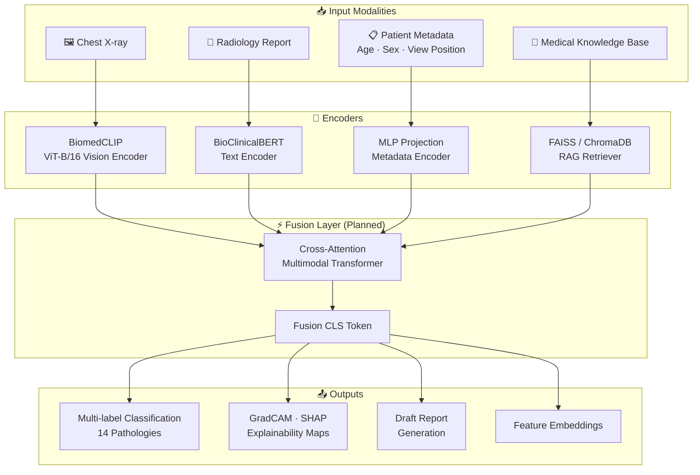
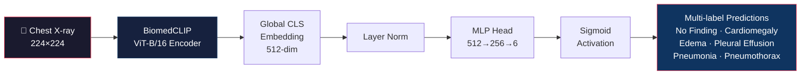
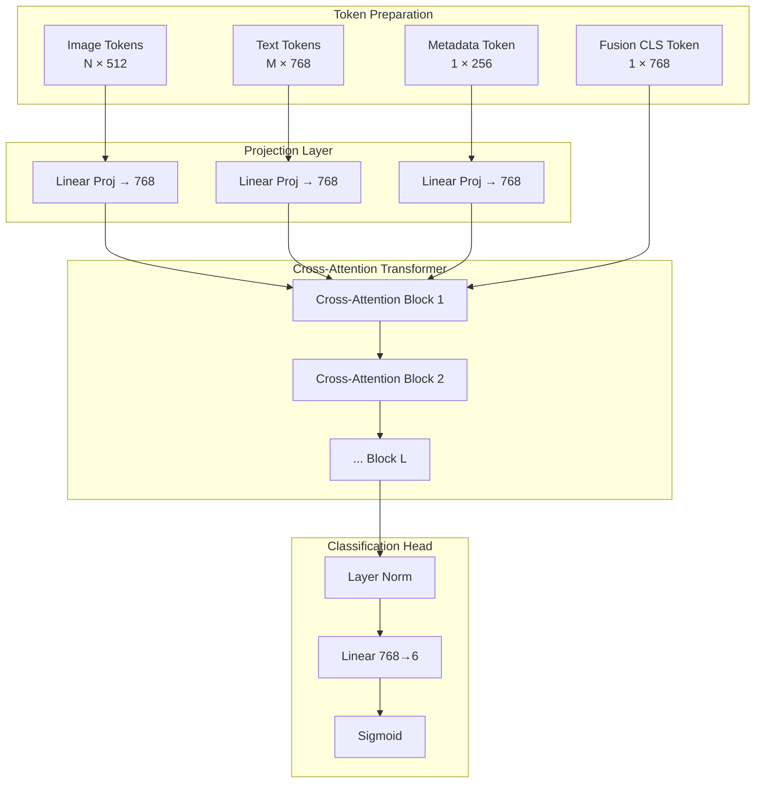
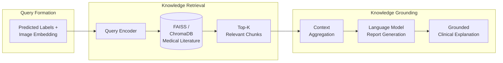
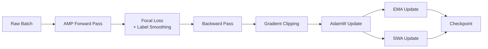
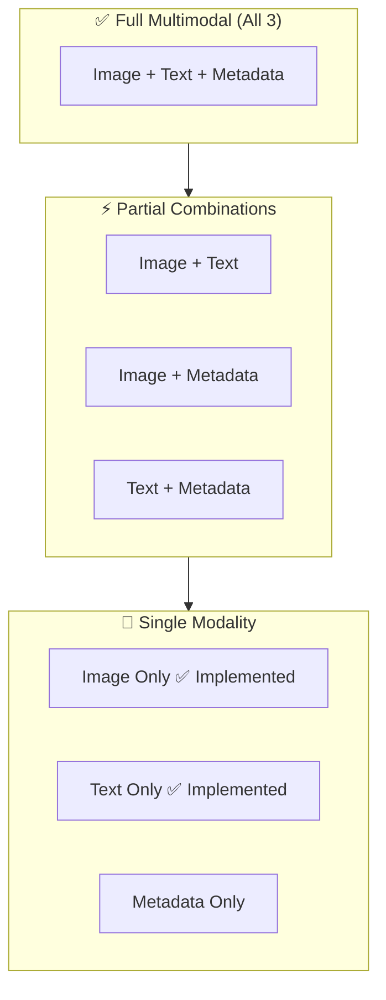
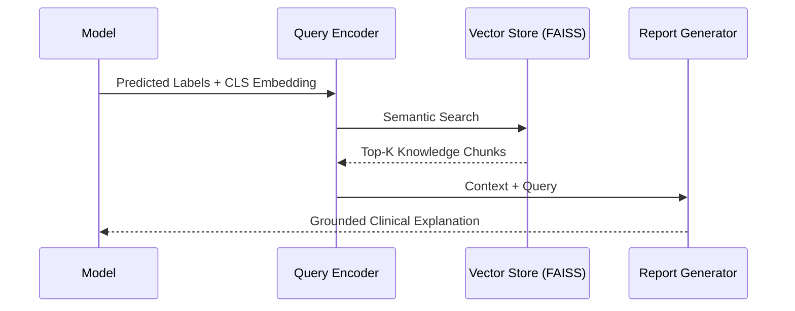
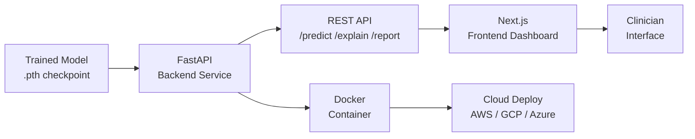
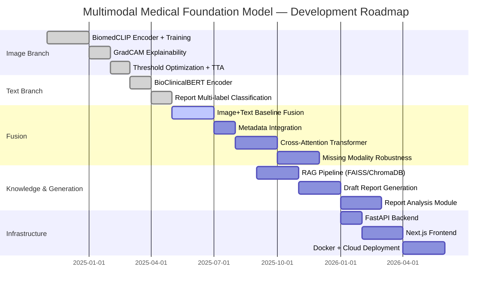

<div align="center">

# 🧠 Multimodal Medical Foundation Model

### *A Research Framework for Chest X-ray Understanding via Multimodal AI*

<br/>


<br/>

> **⚠️ Research & Educational Use Only — Not a Clinical Device**

<br/>

[📖 Overview](#-overview) •
[🏗️ Architecture](#-architecture) •
[📊 Results](#-experimental-results) •
[🚀 Quick Start](#-installation) •
[🗺️ Roadmap](#-roadmap) •
[📚 Citation](#-citation)

---

</div>

## 🌟 Highlights

<table>
<tr>
<td width="33%" align="center">
<h3>🖼️ Image Branch</h3>
<b>BiomedCLIP</b> vision encoder fine-tuned on MIMIC-CXR<br/>
<b>Macro AUROC: 0.8656</b>
</td>
<td width="33%" align="center">
<h3>📝 Text Branch</h3>
<b>BioClinicalBERT</b> report encoder<br/>
Multi-label classification from radiology text
</td>
<td width="33%" align="center">
<h3>🔬 Research-Grade</h3>
EMA · SWA · AMP · GradCAM<br/>
Missing Modality Robustness · RAG
</td>
</tr>
</table>

---

## 📖 Overview

**Multimodal Medical Foundation Model** is a research framework for automated chest X-ray understanding that combines:

| Modality | Source | Encoder |
|----------|--------|---------|
| 🖼️ Chest X-ray Images | MIMIC-CXR | BiomedCLIP ViT-B/16 |
| 📝 Radiology Reports | MIMIC-CXR | BioClinicalBERT |
| 📋 Structured Metadata | Patient demographics | MLP projection |
| 🧬 External Knowledge | Medical literature | FAISS / ChromaDB RAG |

### 🎯 Supported Tasks

- ✅ Multi-label chest pathology classification
- ✅ Missing modality robustness (any subset of modalities)
- ✅ Explainability via GradCAM & attention visualization
- ✅ Knowledge-grounded clinical reasoning (RAG)
- 🔄 Draft radiology report generation *(planned)*
- 🔄 Uploaded report analysis *(planned)*
- 🔄 Uncertainty estimation *(planned)*

---

## 🏗️ Architecture

### Full System Pipeline



---

### 🖼️ Image Branch Architecture



---

### 📝 Text Branch Architecture


---

### ⚡ Planned Multimodal Fusion Transformer



---

### 🔍 RAG Pipeline



---

## 📁 Repository Structure

```
multimodal-medical-foundation-model/
│
├── 📄 README.md                    ← You are here
├── 📋 requirements.txt             ← Root-level dependencies
├── 📁 src/                         ← Core source library
│   ├── eval/                       ← Evaluation scripts
│   ├── rag/                        ← RAG pipeline (FAISS / ChromaDB)
│   └── train/                      ← Training scripts
│
└── 📁 image_only_model/            ← ✅ Image-Only Module (Implemented)
    ├── 📓 biomedclip-image-classifier.ipynb
    ├── 🐍 data_preprocessing.py
    ├── 📄 data_preprocessing_explanation.txt
    ├── 📊 audit_report.md
    ├── 📋 requirements.txt
    ├── 🔧 .gitignore
    ├── 📁 configs/
    │   └── training_config.json    ← Hyperparameters
    ├── 📁 output/
    │   ├── final_metrics.json      ← Test-set results
    │   ├── thresholds.json         ← Per-class thresholds
    │   ├── tta_metrics.json        ← TTA evaluation
    │   ├── training_history.pkl    ← Training curves
    │   └── plots/
    │       ├── auroc_bar.png
    │       ├── confusion_matrices.png
    │       ├── roc_curves.png
    │       └── training_history.png
    ├── 📁 src/
    │   ├── eval/evaluate.py
    │   ├── rag/indexer.py
    │   ├── rag/retriever.py
    │   ├── train/train_baselines.py
    │   └── train/train_fusion.py
    └── 📁 tests/
        └── test_smoke.py
```

---

## 🗃️ Dataset

<details>
<summary><b>📂 MIMIC-CXR Dataset Details (click to expand)</b></summary>

| Property | Details |
|----------|---------|
| **Name** | MIMIC-CXR v2.0 |
| **Source** | PhysioNet (credentialed access required) |
| **Images** | ~227,000 chest X-ray studies |
| **Reports** | Paired radiology reports |
| **Labels** | 14 CheXpert pathology labels |
| **Split Strategy** | Patient-level (no patient appears in >1 split) |

**Target Pathologies in this work:**

| Label | Positive % | AUROC |
|-------|-----------|-------|
| No Finding | — | 0.8894 |
| Cardiomegaly | — | 0.8905 |
| Edema | — | 0.8927 |
| Pleural Effusion | — | 0.8830 |
| Pneumonia | — | 0.8018 |
| Pneumothorax | — | 0.8362 |

> Access MIMIC-CXR: https://physionet.org/content/mimic-cxr/2.0.0/
> PhysioNet credentialed access is required.

</details>

---

## 🔬 Image Branch — Full Details

<details>
<summary><b>🖼️ Image Branch Implementation Details (click to expand)</b></summary>

### Encoder
| Component | Details |
|-----------|---------|
| **Model** | `microsoft/BiomedCLIP-PubMedBERT_256-vit_base_patch16_224` |
| **Backbone** | ViT-Base / Patch16 / 224px |
| **Embedding Dim** | 512 |
| **Pre-training** | Biomedical image-text pairs (PMC articles) |

### Training Features

| Feature | Implementation |
|---------|---------------|
| Loss Function | Focal Loss + Label Smoothing |
| Class Imbalance | Weighted BCE |
| Precision | Mixed Precision (AMP) |
| Model Averaging | EMA + SWA |
| LR Schedule | Cosine Annealing |
| Early Stopping | ✅ Patience-based |
| Threshold Opt. | ✅ Per-class Youden's J |
| Test-Time Aug. | ✅ Multi-crop ensemble |
| Multi-GPU | ✅ DataParallel |
| Checkpointing | ✅ Resume support |

### Explainability Methods

- 🔥 **GradCAM** — Class activation maps per pathology
- 🔥 **GradCAM++** — Improved localization
- 📐 **Threshold-based predictions** — Per-class clinical thresholds
- ⚕️ **Clinical consistency rules** — Anatomical plausibility checks

</details>

---

## 📝 Text Branch — Full Details

<details>
<summary><b>📄 Text Branch Implementation Details (click to expand)</b></summary>

### Encoder
| Component | Details |
|-----------|---------|
| **Model** | `emilyalsentzer/Bio_ClinicalBERT` |
| **Architecture** | BERT-Base |
| **Embedding Dim** | 768 (CLS token) |
| **Pre-training** | Clinical notes (MIMIC-III) |

### Pipeline
```
Radiology Report
     ↓
BioClinicalBERT Tokenizer (max_len=512)
     ↓
BioClinicalBERT Encoder
     ↓
CLS Embedding (768-dim)
     ↓
MLP Head: 768 → 256 → 6
     ↓
Sigmoid → Multi-label Output
```

**Status:** ✅ Completed

</details>

---

## 🏋️ Training Strategy

<details>
<summary><b>⚙️ Full Training Configuration (click to expand)</b></summary>

```json
{
  "model": "microsoft/BiomedCLIP-PubMedBERT_256-vit_base_patch16_224",
  "image_size": 224,
  "batch_size": 32,
  "num_epochs": 30,
  "optimizer": "AdamW",
  "learning_rate": 1e-4,
  "weight_decay": 1e-2,
  "loss": "focal_loss",
  "label_smoothing": 0.1,
  "amp": true,
  "ema_decay": 0.999,
  "swa": true,
  "lr_scheduler": "cosine_annealing",
  "early_stopping_patience": 7,
  "num_classes": 6,
  "split": "patient_level"
}
```

### Training Stability Techniques



</details>

---

## 📊 Experimental Results

### 🏆 Image-Only Model Performance

| Metric | Value |
|--------|-------|
| **Macro AUROC** | **0.8656** |
| **Micro AUROC** | **0.8829** |
| **Macro F1** | **0.6229** |
| **Micro F1** | **0.7050** |

### Per-Class AUROC

```
No Finding       ████████████████████ 0.8894
Cardiomegaly     ████████████████████ 0.8905
Edema            ████████████████████ 0.8927  ← Best
Pleural Effusion ████████████████████ 0.8830
Pneumonia        ██████████████████░░ 0.8018
Pneumothorax     ███████████████████░ 0.8362
                 0.75              0.90
```

| Pathology | AUROC | Status |
|-----------|-------|--------|
| No Finding | 0.8894 | 🟢 |
| Cardiomegaly | 0.8905 | 🟢 |
| Edema | **0.8927** | 🟢 Best |
| Pleural Effusion | 0.8830 | 🟢 |
| Pneumonia | 0.8018 | 🟡 |
| Pneumothorax | 0.8362 | 🟢 |

### Evaluation Metrics Computed

| Category | Metrics |
|----------|---------|
| **Ranking** | Macro AUROC, Micro AUROC, Average Precision |
| **Classification** | Macro F1, Micro F1, Precision, Recall |
| **Multi-label** | Exact Match Accuracy, Hamming Accuracy |

---

## 🗺️ Missing Modality Strategy

A key research contribution of this project is **robustness to missing input modalities**.



The fusion transformer will be trained with **modality dropout** so it can run inference regardless of which inputs are available — critical for real-world clinical deployment.

---

## 💡 Explainability

<details>
<summary><b>🔍 Explainability Methods (click to expand)</b></summary>

| Method | Modality | Output |
|--------|----------|--------|
| **GradCAM** | Image | Heatmap over X-ray |
| **GradCAM++** | Image | Refined localization |
| **SHAP** | All | Feature attribution scores |
| **Attention Rollout** | Text | Token importance |
| **Threshold Maps** | All | Per-class decision boundaries |

GradCAM localizes pathology regions directly on the X-ray image, producing clinically interpretable heatmaps that a radiologist can inspect.

</details>

---

## 🧬 RAG Pipeline

<details>
<summary><b>📚 Retrieval-Augmented Generation Details (click to expand)</b></summary>

The RAG component grounds model predictions in external medical literature:

1. **Indexing** — Medical textbook chapters, clinical guidelines, PubMed abstracts are chunked and embedded into a FAISS/ChromaDB vector store.
2. **Retrieval** — At inference, predicted labels + image embeddings form a query to retrieve top-K relevant knowledge chunks.
3. **Grounding** — Retrieved context is injected into the generation prompt, producing evidence-backed explanations.



</details>

---

## 🚀 Installation

### Prerequisites

- Python 3.10+
- CUDA 11.8+ (recommended)
- 16 GB+ GPU memory for training

### Setup

```bash
# 1. Clone the repository
git clone https://github.com/VNK1404/multimodal-medical-foundation-model.git
cd multimodal-medical-foundation-model

# 2. Create a virtual environment
python -m venv venv
source venv/bin/activate        # Windows: venv\Scripts\activate

# 3. Install dependencies
pip install -r requirements.txt

# 4. (Optional) Install image-only module dependencies
pip install -r image_only_model/requirements.txt
```

---

## 🎮 Usage

### Quick Inference — Image Branch

```python
from image_only_model.src.eval.evaluate import BiomedCLIPClassifier

# Load model
model = BiomedCLIPClassifier.from_pretrained("path/to/checkpoint")

# Run inference
predictions = model.predict("path/to/chest_xray.jpg")
print(predictions)
# {'No Finding': 0.12, 'Cardiomegaly': 0.87, 'Edema': 0.34, ...}
```

### Run the Training Notebook

```bash
cd image_only_model
jupyter notebook biomedclip-image-classifier.ipynb
```

---

## 🏋️ Training Instructions

<details>
<summary><b>⚙️ Training Commands (click to expand)</b></summary>

```bash
# Single GPU
python -m image_only_model.src.train.train_baselines \
  --config image_only_model/configs/training_config.json \
  --data_dir /path/to/mimic-cxr

# Multi-GPU (DataParallel)
CUDA_VISIBLE_DEVICES=0,1 python -m image_only_model.src.train.train_baselines \
  --config image_only_model/configs/training_config.json \
  --data_dir /path/to/mimic-cxr \
  --multi_gpu

# Resume from checkpoint
python -m image_only_model.src.train.train_baselines \
  --config image_only_model/configs/training_config.json \
  --resume path/to/checkpoint.pth
```

</details>

---

## 📡 Inference Instructions

<details>
<summary><b>🔬 Inference & Evaluation Commands (click to expand)</b></summary>

```bash
# Run evaluation on test set
python -m image_only_model.src.eval.evaluate \
  --checkpoint path/to/best_model.pth \
  --data_dir /path/to/mimic-cxr/test \
  --output_dir image_only_model/output/

# Run with Test-Time Augmentation
python -m image_only_model.src.eval.evaluate \
  --checkpoint path/to/best_model.pth \
  --tta \
  --tta_steps 10
```

</details>

---

## 🚢 Deployment Plan



| Component | Technology | Status |
|-----------|-----------|--------|
| Model serving | FastAPI | 🔄 Planned |
| Frontend | Next.js 14 | 🔄 Planned |
| Containerization | Docker | 🔄 Planned |
| Cloud | AWS / GCP | 🔄 Planned |

---

## 🗺️ Roadmap



### ✅ Completed
- [x] BiomedCLIP image encoder + fine-tuning pipeline
- [x] Multi-label classification (6 pathologies)
- [x] Patient-level dataset splits
- [x] Focal Loss + Label Smoothing + Class Weighting
- [x] AMP, EMA, SWA, Cosine LR, Early Stopping
- [x] Threshold Optimization + TTA
- [x] GradCAM + GradCAM++ explainability
- [x] Full evaluation metrics suite
- [x] BioClinicalBERT text branch

### 🔄 In Progress
- [ ] Image + Text early/late fusion baseline
- [ ] Metadata encoding and integration

### 🗓️ Planned
- [ ] Cross-Attention Multimodal Fusion Transformer
- [ ] Missing modality robustness (modality dropout training)
- [ ] SHAP feature attribution
- [ ] RAG pipeline (FAISS + ChromaDB)
- [ ] Draft radiology report generation
- [ ] Existing report analysis module
- [ ] Uncertainty estimation (MC Dropout + calibration)
- [ ] FastAPI REST backend
- [ ] Next.js clinical dashboard frontend
- [ ] Docker containerization
- [ ] Cloud deployment (AWS/GCP)

---

## 🧰 Tech Stack

| Category | Technologies |
|----------|-------------|
| **Deep Learning** | PyTorch 2.x, HuggingFace Transformers |
| **Vision Encoder** | BiomedCLIP (ViT-B/16) |
| **Text Encoder** | BioClinicalBERT |
| **Explainability** | GradCAM, GradCAM++, SHAP |
| **Knowledge Retrieval** | FAISS, ChromaDB |
| **Experiment Tracking** | Weights & Biases *(planned)* |
| **Backend** | FastAPI, Uvicorn |
| **Frontend** | Next.js 14, React |
| **Infrastructure** | Docker, AWS/GCP |
| **Data** | MIMIC-CXR (PhysioNet) |
| **Notebooks** | Jupyter, nbformat |

---

## 🔬 Research Contributions

<details>
<summary><b>📑 Key Research Contributions (click to expand)</b></summary>

1. **End-to-end multimodal fusion framework** combining vision, language, and structured data for chest X-ray understanding.

2. **Missing modality robustness** — a single unified model that handles any combination of available modalities without re-training.

3. **Knowledge-grounded reasoning** via RAG — bridging the gap between discriminative classification and generative clinical explanation.

4. **Comprehensive training recipe** combining Focal Loss, EMA, SWA, AMP, and threshold optimization for imbalanced medical datasets.

5. **Clinically-interpretable explainability** pipeline combining GradCAM heatmaps with text attention visualization.

</details>

---

## ⚠️ Limitations

- Model is trained and evaluated only on **MIMIC-CXR** (US hospital population). Generalizability to other populations/equipment is not guaranteed.
- Currently limited to **6 of 14** CheXpert pathology labels.
- Large model weights (~1.4 GB) are not included in this repository.
- Report generation is **planned** and not yet implemented.
- **NOT validated** for clinical use — research only.

---

## ⚖️ Ethical Considerations

> [!IMPORTANT]
> This system is intended **strictly for research and educational purposes**.

- 🏥 **Not a clinical device** — Do not use for patient diagnosis or treatment decisions.
- 🔒 **Data privacy** — MIMIC-CXR requires PhysioNet credentialed access and a data use agreement. Do not redistribute raw data.
- ⚕️ **Bias awareness** — Performance may vary across demographics, imaging equipment, and institutions.
- 🧑‍⚕️ **Human oversight** — Any AI output in medical contexts requires qualified clinical review.
- 📊 **Uncertainty** — The model does not yet output calibrated uncertainty estimates (planned).

---

## 📚 Citation

If you find this work useful in your research, please cite:

```bibtex
@misc{vnk2025multimodal,
  author       = {VNK1404},
  title        = {Multimodal Medical Foundation Model for Chest X-ray Understanding},
  year         = {2025},
  publisher    = {GitHub},
  howpublished = {\url{https://github.com/VNK1404/multimodal-medical-foundation-model}},
  note         = {Research prototype. Not for clinical use.}
}
```

**Key dependencies to also cite:**

- BiomedCLIP: Zhang et al., *BiomedCLIP: a multimodal biomedical foundation model*, arXiv 2023.
- MIMIC-CXR: Johnson et al., *MIMIC-CXR-JPG*, PhysioNet 2019.
- BioClinicalBERT: Alsentzer et al., *Publicly available Clinical BERT Embeddings*, 2019.

---

## 🙏 Acknowledgements

- [Microsoft Research](https://huggingface.co/microsoft/BiomedCLIP-PubMedBERT_256-vit_base_patch16_224) — BiomedCLIP pre-trained model
- [Emily Alsentzer](https://huggingface.co/emilyalsentzer/Bio_ClinicalBERT) — BioClinicalBERT
- [PhysioNet / MIMIC Team](https://physionet.org/content/mimic-cxr/2.0.0/) — MIMIC-CXR dataset
- The open-source medical AI community

---

## 📄 License

This project is licensed under the **MIT License** — see the [LICENSE](LICENSE) file for details.

---

<div align="center">

**Made with ❤️ for Medical AI Research**

⭐ If this project helps your research, please give it a star!

[](https://github.com/VNK1404/multimodal-medical-foundation-model/stargazers)

</div>
