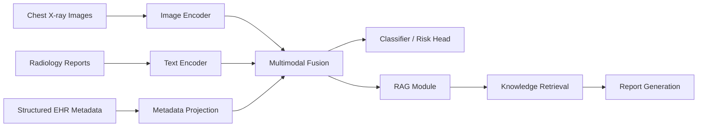

# Architecture

## High-Level System Diagram

The system ingests chest X-ray images, radiology reports, and structured EHR metadata through dedicated encoders. These features are fused into a shared representation that feeds a classifier, retrieval-augmented generation pipeline, and report generation components.

## Planned Phases

- Data ingestion, cleaning, and indexing.
- Baseline unimodal and simple fusion experiments.
- Multimodal fusion training with missing-modality robustness.
- RAG integration for knowledge-grounded report generation.
- Explainability, calibration, and uncertainty analysis.
- Evaluation, packaging, and deployment preparation.
