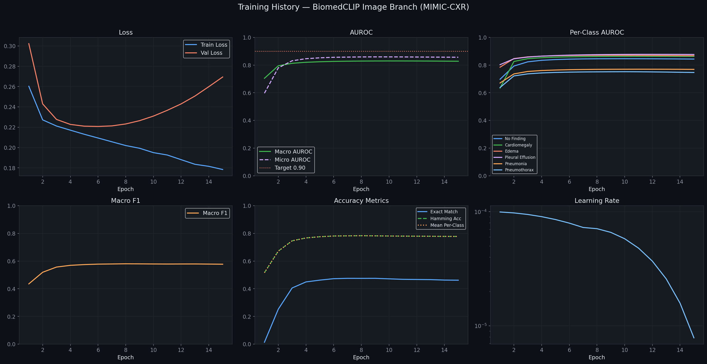
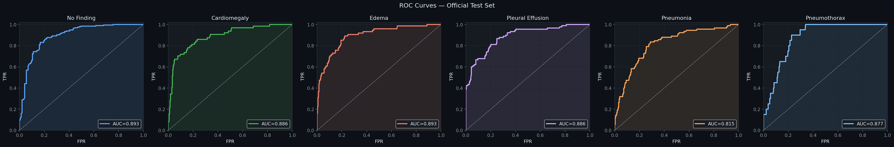
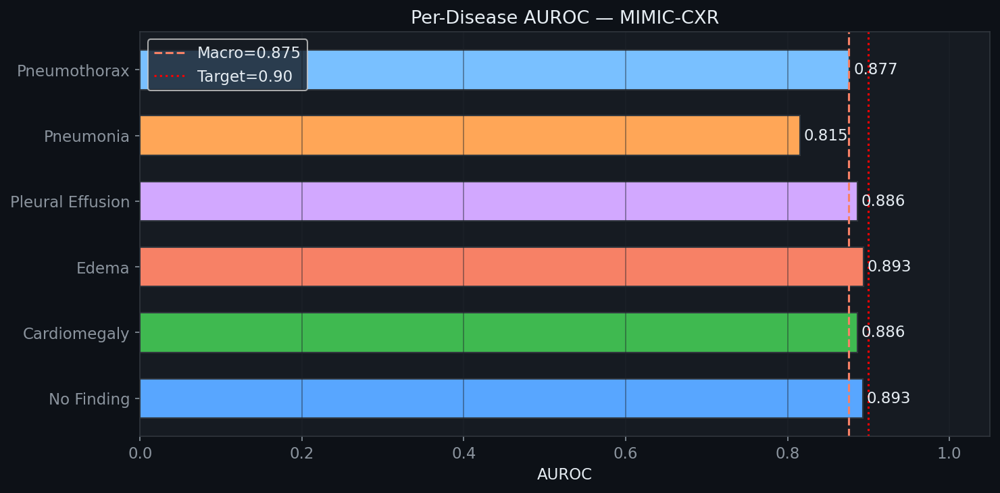
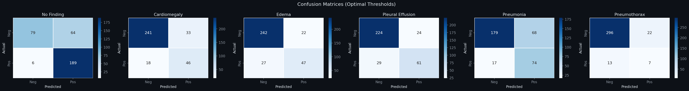

# 🩺 BiomedCLIP Image-Only Branch — MIMIC-CXR Chest X-Ray Classifier

> **Part of the Multimodal Medical Foundation Model project.**  
> This branch contains the complete image-only classification pipeline trained on MIMIC-CXR using Microsoft BiomedCLIP as the backbone.

---

## 📋 Overview

This model fine-tunes the **BiomedCLIP ViT-B/16** vision encoder on 6 chest pathology labels from the **MIMIC-CXR** dataset. It serves as the **image branch** of a larger multimodal fusion model combining vision and clinical text.

| Property | Value |
|----------|-------|
| Backbone | `microsoft/BiomedCLIP-PubMedBERT_256-vit_base_patch16_224` |
| Dataset | MIMIC-CXR (official ICCV split) |
| Image Size | 224 × 224 |
| Classes | 6 (No Finding, Cardiomegaly, Edema, Pleural Effusion, Pneumonia, Pneumothorax) |
| Task | Multi-label Binary Classification |
| Framework | PyTorch + open_clip |

---

## 🏆 Results (Test Set)

| Class | AUROC | F1 |
|-------|-------|----|
| No Finding | **0.893** | 0.844 |
| Cardiomegaly | **0.886** | 0.643 |
| Edema | **0.893** | 0.657 |
| Pleural Effusion | **0.886** | 0.697 |
| Pneumonia | **0.815** | 0.635 |
| Pneumothorax | **0.877** | 0.286 |
| **Macro AUROC** | **0.875** | — |
| **Micro AUROC** | **0.888** | — |
| **Macro F1** | — | **0.627** |

> Full metrics in [`output/final_metrics.json`](output/final_metrics.json)  
> TTA metrics in [`output/tta_metrics.json`](output/tta_metrics.json)

---

## 📂 Repository Structure

```
image_only_model/
│
├── biomedclip-image-classifier.ipynb   # Main training & evaluation notebook (run on Kaggle)
├── data_preprocessing.py               # Subject-level split logic & leakage detection
├── data_preprocessing_explanation.txt  # Human-readable explanation of preprocessing
├── audit_report.md                     # Change log & architecture decisions
├── .gitignore                          # Excludes large .pth / .npy / .csv files
│
├── configs/
│   └── training_config.json            # All hyperparameters used for training
│
└── output/
    ├── final_metrics.json              # Per-class & aggregate test metrics
    ├── thresholds.json                 # Optimal per-class classification thresholds
    ├── tta_metrics.json                # Baseline vs EMA+TTA comparison metrics
    ├── training_history.pkl            # Epoch-wise training curves (loss, AUROC, F1)
    └── plots/
        ├── training_history.png        # Loss, AUROC, F1, LR curves over 15 epochs
        ├── roc_curves.png              # Per-class ROC curves on test set
        ├── auroc_bar.png               # Bar chart of per-disease AUROC
        └── confusion_matrices.png      # Confusion matrices at optimal thresholds
```

> **Note:** Model weight files (`best_model.pth`, `best_model_ema.pth`) and embedding arrays (`image_embeddings.npy`) are excluded from git due to size. Download them from the Kaggle notebook output.

---

## ⚙️ Training Configuration

Key hyperparameters (full config in [`configs/training_config.json`](configs/training_config.json)):

| Parameter | Value |
|-----------|-------|
| Epochs | 20 (early stopped at 15) |
| Batch size | 64 |
| Encoder LR | 3e-6 |
| Head LR | 1e-4 |
| Weight decay | 5e-4 |
| Label smoothing | 0.05 |
| Unfrozen layers | Last 8 transformer blocks |
| EMA decay | 0.9995 |
| SWA start | Epoch 8 |
| TTA | Enabled (horizontal flip) |

---

## 🚀 How to Run

### On Kaggle (Recommended)
1. Upload `biomedclip-image-classifier.ipynb` to a new Kaggle notebook.
2. Add the following datasets:
   - `simhadrisadaram/mimic-cxr-dataset`
   - `vedantkulkarni14/labeled-mimic-cxr`
3. Enable **GPU T4 × 2** accelerator.
4. Run all cells. Outputs will be saved to `/kaggle/working/`.

---

## 🔬 Key Features

- **BiomedCLIP Backbone** — Pre-trained on 15M biomedical image-text pairs
- **Partial Fine-tuning** — Last 8 transformer blocks + classification head
- **EMA (Exponential Moving Average)** — Decay 0.9995 for smoother generalization
- **SWA (Stochastic Weight Averaging)** — From epoch 8 with lr=1e-6
- **TTA (Test-Time Augmentation)** — Horizontal flip ensemble at inference
- **Dynamic Threshold Optimization** — Per-class F1-optimized thresholds
- **GradCAM Explainability** — Visual attribution maps for Vision Transformers
- **Embedding Extraction** — 512-dim visual embeddings for multimodal fusion

---

## 📊 Training Plots

| Training History | ROC Curves |
|-----------------|------------|
|  |  |

| AUROC Bar Chart | Confusion Matrices |
|-----------------|-------------------|
|  |  |

---

## 🔗 Related Branches

| Branch | Description |
|--------|-------------|
| `main` | Project overview and integration |
| `label_generation` | MIMIC-CXR label preprocessing pipeline |
| `image_only_model` | **This branch** — Image classification pipeline |

---

## 📦 Model Weights (Not in Git)

| File | Size | Description |
|------|------|-------------|
| `best_model.pth` | ~1.40 GB | Best validation checkpoint |
| `best_model_ema.pth` | ~1.40 GB | EMA-averaged best checkpoint |
| `image_embeddings.npy` | ~89 MB | 512-dim visual embeddings for fusion |

Download from Kaggle notebook output: `mimic_cxr_image_branch_outputs.zip`
